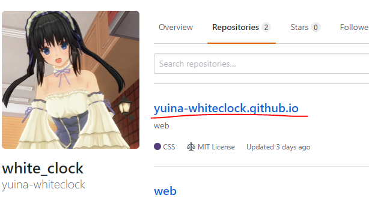
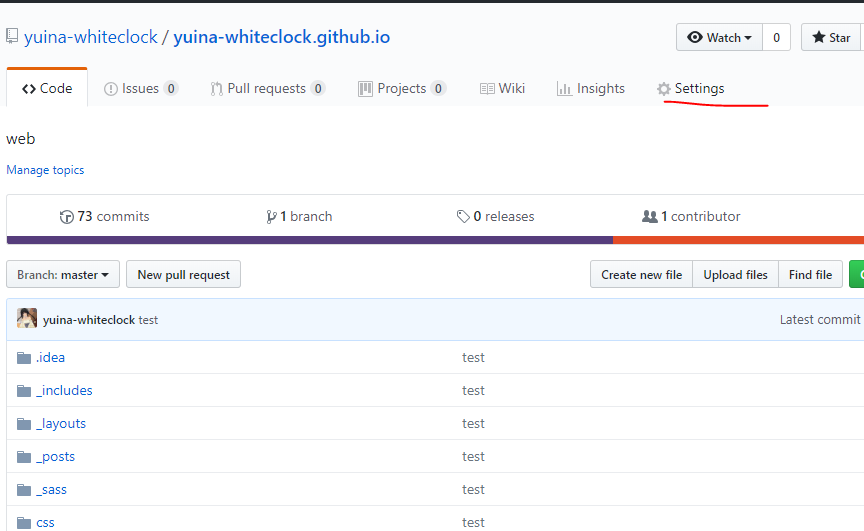
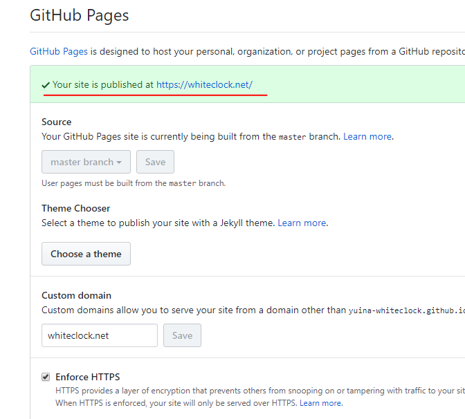

---

published: true
title: GitHubPagesへの登録
layout: post
author: white_clock
keywords: サイト作成,GithubPages
category: 初心者向け
permalink: /web/github
tags:
- Github
---
### GitHubへ登録
[このサイトが参考になります](https://qiita.com/kooohei/items/361da3c9dbb6e0c7946b)。

### GitHubPagesへの準備
[ここ](https://pages.github.com/)
を見てもらえばいいのですが、英語で読むのがだるい人の為に一応説明します。

新規リポジトリを作成します。この際に、リポジトリ名を  
**Githubのユーザー名.github.io**  
にします。自分の場合は次のようになります。
 
ここにHTMLファイルを置くことでサイトが公開されます。試しに自分のリポジトリにHTMLファイルを
おいてみてください。その際のURLは

を押して下にスクロールしたところの

で公開されています。実際に検索して表示されているか見てみましょう。
