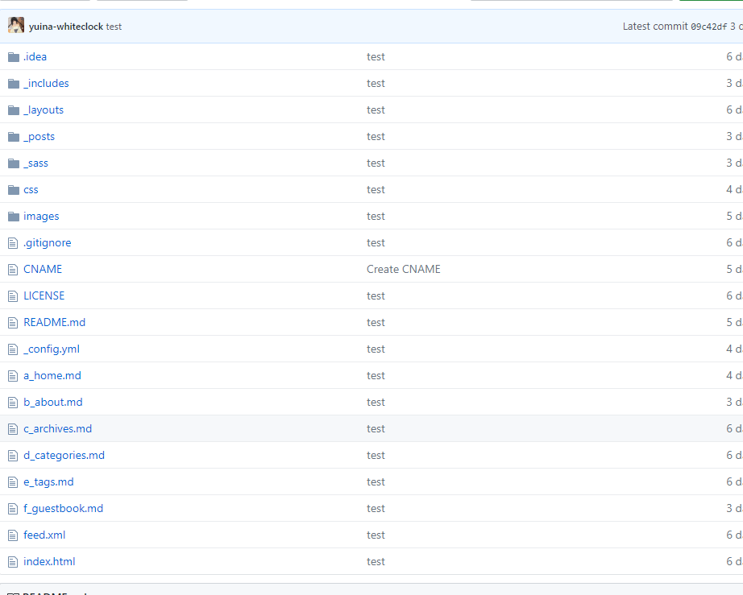
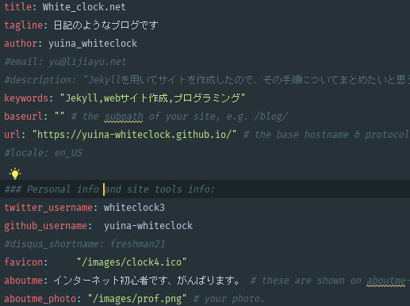

---

published: true
title: テーマ編集その２
layout: post
author: white_clock
keywords: jekyll,サイト作成
category: サイト作成
permalink: /web/jekyll_2
tags:
- Jekyll
---
### サイト構成

_idea :
:  ひとまず無視してよい

_include :
: ヘッダー・フッター・サイドバーなどのレイアウトが入っている

_layouts :
: サイトの普遍的なレイアウトなどが入っている

_posts :
: ここにMarkdownファイルをいれて記事を追加していく。

_sass及びcss :
: scssファイルがまとめられている。cssを調整するときはここをいじる。

_images :
: サイトアイコンや画像はここへ

_config.yml :
: 設定をここに記述。

a_homeなどのmarkdownファイル群 :
: ページリンクの設定(ホーム・このブログについてなど)

index.html :
: ひとまず無視して良い
## 編集手順

1. まず、選んだテーマをダウンロードして、テキストエディタでそのディレクトリを開きます。
2. _config.ymlを編集します。

    

    title :
: ブログ全体のタイトル

    baseurl :
: 好みがなければ上記の画像と同じで大丈夫  

    url :
: 自分のサイトのurl  

    default_local :
: 画像にはありませんが、jaに設定   
以上の四点を変えれば最低限大丈夫だと思います。

3. **Markdownにファイルを突っ込む**  
    サンプルと似たような感じにMarkdownを書くとうまく反映されると思います。以下の設定はやりたい人だけどうぞ。

4. **Sassの編集**  
    _sassフォルダのlayout.sassとbase.sass、cssフォルダのmain.scssをいじりましょう。SaSsは
    CSSを書きやすくしただけなので、CSSと同じ要領で大丈夫だと思います。なんならCSSと同じように書いてもらって大丈夫です。
 
    困ったらGoogle Chromeのデベロッパーツールをみて編集を頑張ってください。

5. **HTMLの編集**  
    JekyllにはLiquidというものが使われています。よって、HTMLをいじるためには、LiquidとJekyllの知識が
必要となります。以下にリンクをはっておくので、興味のある人はどうぞ。

[Jekyll](https://jekyllrb-ja.github.io/)

[Liquid](https://shopify.github.io/liquid/)

[SaSS](https://dotinstall.com/lessons/basic_sass)

