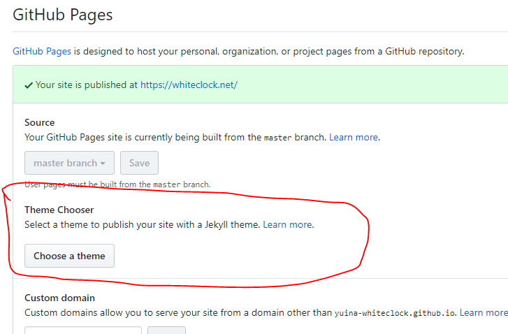
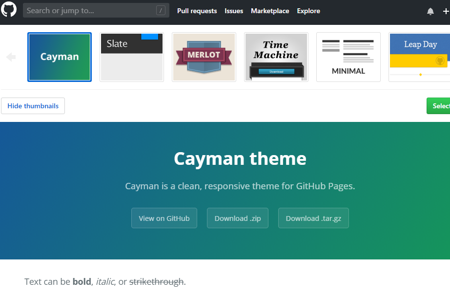

---

published: true
title: Jekyllテーマの選択
layout: post
author: white_clock
keywords: jekyll,サイ作成
category: 初心者向け
permalink: /web/theme1
tags:
- Jekyll
---
### テーマを選択

を押します。

の中から好きなやつを選びます。

### ファイルの公開
_.config.ymlというファイルが生成されているはずです。
ここに、Markdownで書かれたファイルを置き、(HTMLファイルでもおそらく良い)
Settingに書いてある自分のサイトへ行くとテーマにそったファイルができていると思われる。

### 他のテーマ
上記のテーマが気に入らない方へ、他の人が作ったテーマもあるので紹介します（自分はFreshman21
を参考にしました)。以下のサイトのテーマ一覧から好きなものを見つけてみると良いと思います。

<https://morizyun.github.io/blog/jekyll-blog-github-page/index.html>