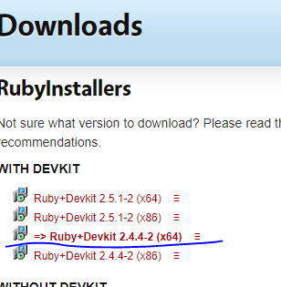
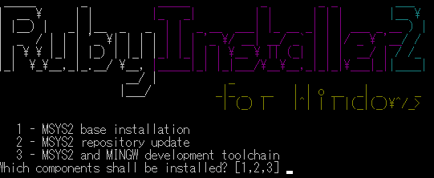

---

published: true
title: Rubyのインストールなど
layout: post
author: white_clock
keywords: jekyll,サイト作成,ruby
category: 初心者向け
permalink: /web/ruby
tags:
- Jekyll
---
### Rubyをインストールするわけ
Rubyをインストールしなくても、GitHubPagesにMarkdownをあげるだけで一応サイトにはなります。しかし、サイトを
更新するときに、いきなり本番の環境で試すことになってしまうのでRubyをインストールし、
ローカルな環境で作業してからGitHubPagesに移しましょう。

### 導入手順(Windows版)

1. RubyInstaller2をインストール([ここをクリック](https://rubyinstaller.org/))  
Downloadボタンを押すとRubyInstallerの一覧が表示されるので、Ruby+Devkit2.4.4-2(x64)をダウンロードしてください。  

2. 何も考えず「次へ」を押してRubyをインストールしてください。
3. MYSY2というものが一緒にインストールされるので、1から順に数字を打っていってください。

4. インストール完了。  

5.Rubyのバージョン確認

ruby -v
=>ruby 2.4.4p296 (2018-03-28 revision 63013) [x64-mingw32]

とでればOKです。
### 補足: GithubPageサイトを公開する場合
6. 以下のコマンドを打ってください。

gem install github-pages

### 補足2: bundlerという便利なものがあるので、余裕があったら以下のサイトを参照
<https://sakanasoft.net/github-pages-by-localhost/>
### Mac版
Macもってないんでわかりません